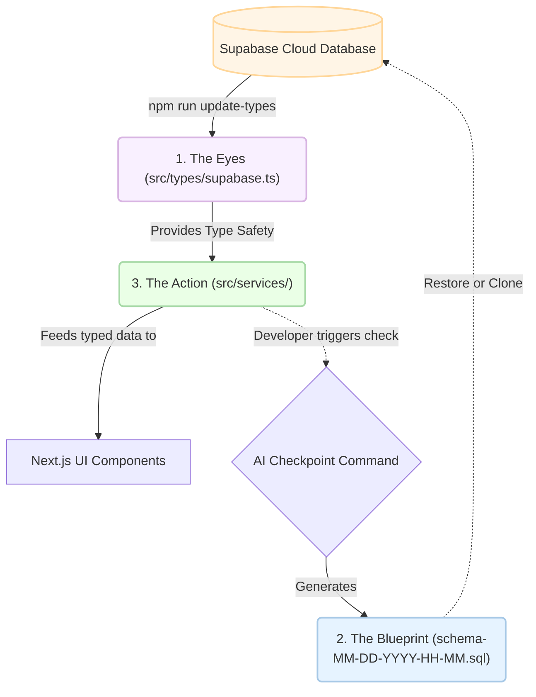

# Understanding the "Eyes, Blueprint, and Action"

To a beginner, the file structure can look messy. Here is the simplified breakdown:

### Architecture Flow

---

### 1. The Eyes (`src/types/supabase.ts`)
- **What it is**: A giant file of TypeScript definitions.
- **Why it exists**: AI cannot "see" your cloud database. This file acts as a mirror. When you run `npm run update-types`, you are giving the AI "new eyes" to see your latest table changes.

### 2. The Blueprint (`supabase/backups/schema-MM-DD-YYYY-HH-MM.sql`)
- **What it is**: A text-based "Save Point" of your entire database structure.
- **Why it exists**: If you mess up your database or want to share your project with a friend, they just "Run" this blueprint in their own Supabase account. It builds the house instantly.

### 3. The Action (`src/services/`)
- **What it is**: Where the actual coding happens.
- **Why it exists**: We keep database logic out of the UI. This folder is the "Kitchen" where data is prepared before it's served to the screen.
